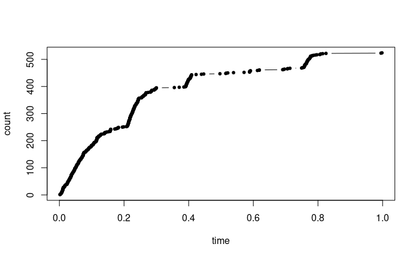
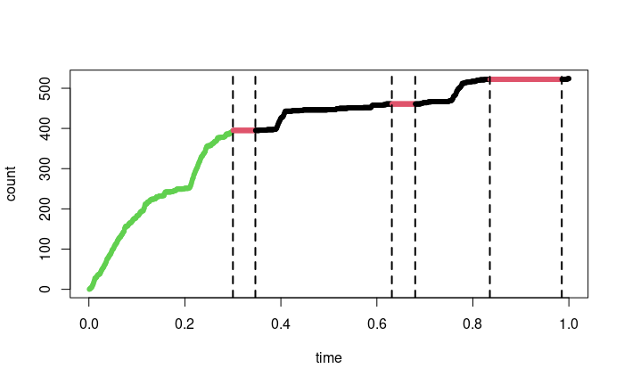

This repo contains an R implementation of the code associated with the paper "Markov switching discrete-time Hawkes process: application to the monitoring of bats' behavior", A. Bonnet, S. Robin (2025).

Hereafter is an example its use on a dataset extracted from the publicly available data provided by the Vigie-Chiro program: https://www.vigienature.fr/fr/chauves-souris


### Data

The dataset consists of $n = 524$ calls along one night (times have been rescaled to the (0, 1) interval). Let us plot the associated count process:


```{r data, echo=FALSE}
setwd('./')
times <- read.table('batcalls.csv', header=FALSE)[, 1]
n <- length(times)
plot(times, 1:n, type='b', pch=20, xlab='time', ylab='count')

```




### Libraries and fixed parameters

The **hawkesbow** library is required for initialization. All functions used for estimation are stored in Function.R. 
We define the following parameters: Tmax (length of the observation window), Q (number of hidden states), coef (discretisation coefficient).

```{r dims, echo=FALSE}
library('hawkesbow') 
source('Functions.R')
Tmax <- 1
Q <- 3 # number of hidden states
coef <- 2 # discretisation coefficient: N = coef * n
N <- ceiling(coef*n)

```

### Building the discrete-time path

We build a discrete path from the continuous path:

```{r discrete, echo=FALSE}
contPath <- list(times=times, states=rep(1, n), hiddenPath=list(states=1, times=0))
discPath <- MakeDiscreteHawkes1D(contPath=contPath, N=N, Tmax=Tmax)
```

### Initialization

```{r init, echo=FALSE}
initFile <- paste0('batcalls-init-Q', Q, '.Rdata')
if(!file.exists(initFile)){
  init <- InitEMHMMHawkes1D(contPath=contPath, nInit=N, Q=Q, Tmax=Tmax)
  save(init, file=initFile)
}else{load(initFile)}
```

### Fitting the discrete-time Hawkes HMM

```{r fit, echo=FALSE}
fitFile <- paste0('batcalls-fit-Q', Q, '.Rdata')
if(!file.exists(fitFile)){
  fit <- EMHMMHawkes1D(discPath=discPath, discParms=init, Q=Q)
  save(fit, file=fitFile)
}else{load(fitFile)}
```

### Output

We plot the initial path with one color for each estimated hidden state.

```{r plot, echo=FALSE}
plot((1:N)/N, cumsum(discPath$y), type='b', pch=20, col=fit$classif, xlab='time', ylab='count')
abline(v=(0.5+which(diff(fit$classif)!=0))/N, lty=2, lwd=2)
```


